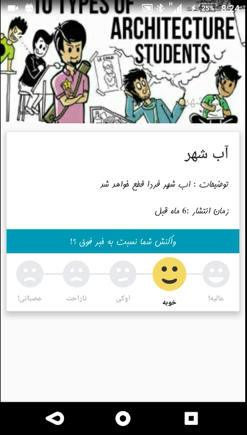

# Daneshjoo_yar
This aplication developed by as my B.Sc project.
It conatins several part and i tried to cover many different things in it.
you can find that i used map, push notification, sqlite, new way of using the drawer, different layout design, ...

Feel free to contact with me if you have any question.
www.eqtech.ir

 

 

